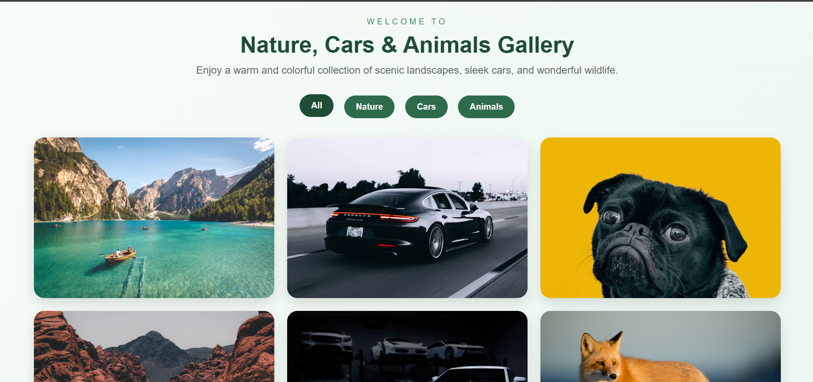

# 🖼️ Responsive Image Gallery

A modern and responsive image gallery built using **HTML**, **CSS**, and **Vanilla JavaScript**. The project showcases a clean, user-friendly interface with smooth interactions and a responsive layout for an enhanced viewing experience.

---
## 📸 Preview



---

## ✨ Features

* 🖼️ Responsive image gallery layout
* ⚡ Smooth user interactions
* 📱 Mobile-friendly design
* 🎨 Modern and clean interface
* 🖱️ Easy image navigation
* 🚀 Fast and lightweight implementation

---

## 🛠️ Technologies Used

* HTML5
* CSS3
* JavaScript (ES6)

---

## 📂 Project Structure


```text

├── favicon.svg          # Website Icon
├── imageGallery.html    # Main HTML File
├── imageGallery.css     # Styling (CSS) File
├── imageGallery.js      # JavaScript Logic File
├── README.md            # Project Documentation
└── screenshot.png       # Project Preview Image

---

## ⚙️ Getting Started

### Clone the repository

```bash
git clone https://github.com/shaheerawan295-png/CodeAlpha_Scenic_Gallery.git
```

### Navigate to the project folder

```bash
cd responsive-image-gallery
```

### Run the project

Open **index.html** in your preferred web browser.

---

## 💡 Future Improvements

* 🔍 Image search
* ❤️ Favorite images
* 🌙 Dark mode
* 🎞️ Slideshow mode
* 📂 Category filters
* ☁️ Cloud image integration

---

## 📄 License

This project is licensed under the **MIT License**.

---

## 👨‍💻 Author

**Muhammad Shaheer Haider**

GitHub: https://github.com/shaheerawan295-png

---

### ⭐ Support

If you found this project helpful, consider giving it a **Star ⭐** on GitHub.
